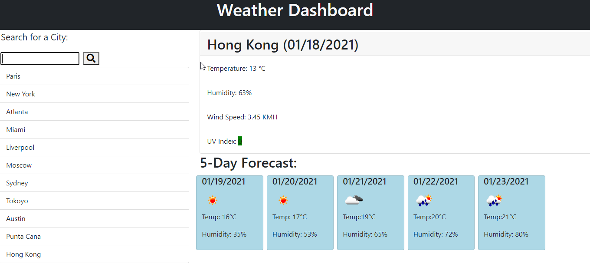

# Weather Dashboard
# University of Toronto Coding BootCamp Challenge Week 5
Allows users to search any city and get the current weather and the 5 day forecast.

## Live Website
https://jshallcross.github.io/weather-dashboard
## Technologies Used
HTML / CSS / JavaScript

## Screenshot

## GitHub Security
Initial Commits came with a warning that my API key was shared. Created a second JS file to store the API key in and added to gitignore file.
